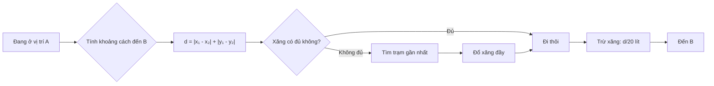
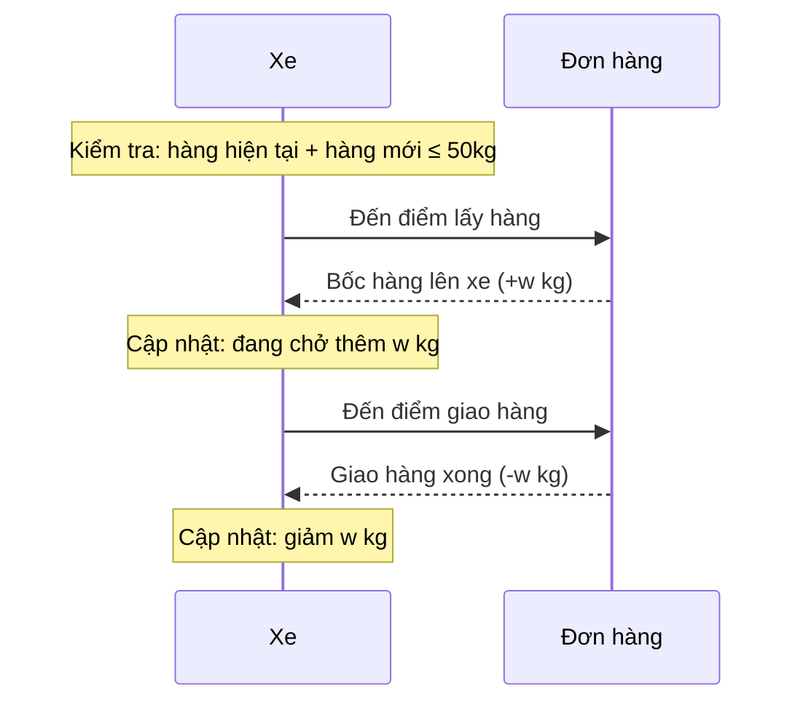
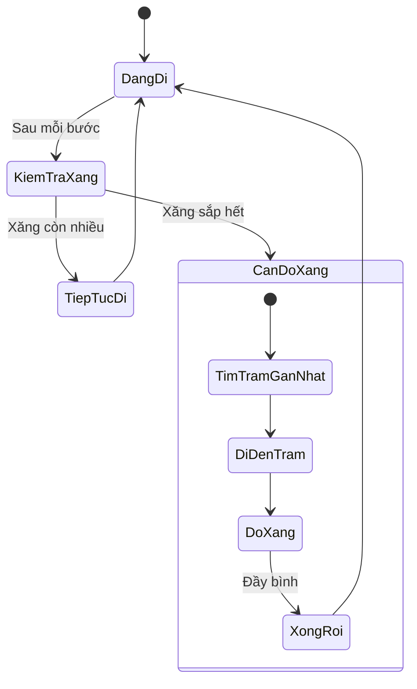
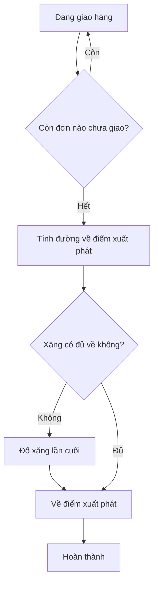

# Tối ưu lộ trình xe giao hàng

## Cách giải quyết bài toán

### 1. Quản lý thông tin
Để giải bài toán này, ta cần theo dõi 3 thứ:
- **Xe tải**: Xe đang ở đâu (x, y), còn bao nhiêu xăng, đang chở bao nhiêu kg hàng
- **Đơn hàng**: Mỗi đơn có địa chỉ lấy hàng, địa chỉ giao hàng, và cân nặng
- **Trạm xăng**: Các điểm có thể đổ xăng trên bản đồ

### 2. Cách tính khoảng cách
Vì xe chỉ đi được 4 hướng (lên/xuống/trái/phải), ta dùng công thức Manhattan:
```
khoảng cách = |x₁ - x₂| + |y₁ - y₂|
```

Ví dụ: Từ điểm (2,3) đến (3,5) thì xe phải đi 3 ô

Xăng tiêu thụ được tính theo:
```
xăng cần = khoảng cách / 20
```

### 3. Chiến lược chọn đường (Thuật toán Greedy)
Ở mỗi bước, xe sẽ quyết định đi đâu tiếp theo như sau:

**Bước 1**: Liệt kê các điểm có thể đến
- Điểm lấy hàng nào mà lấy thêm vẫn không quá tải (tổng kg ≤ W)
- Điểm giao hàng của những đơn đã lấy
- Trạm xăng (nếu sắp hết xăng)

**Bước 2**: Kiểm tra xăng có đủ không
- Tính xem cần bao nhiêu xăng để đến điểm đó
- Đảm bảo sau khi đến vẫn còn đủ xăng để tìm trạm gần nhất
- Nếu không đủ thì phải đổ xăng trước

**Bước 3**: Chọn điểm gần nhất
- Trong các điểm có thể đến, chọn điểm gần nhất
- Di chuyển đến đó và cập nhật lại trạng thái xe


## Code minh họa

```go
type Point struct {
	X, Y int
}

type Order struct {
	ID               int
	Pickup, Delivery Point
	Weight           int
	Picked, Delivered bool
}

type Truck struct {
	Pos     Point
	Fuel    float64
	Payload int
	MaxW    int
	MaxF    float64
}

const FUEL_CONSUMPTION_RATE = 20.0

// Tính khoảng cách Manhattan giữa 2 điểm
func distance(p1, p2 Point) int {
	return int(math.Abs(float64(p1.X-p2.X)) + math.Abs(float64(p1.Y-p2.Y)))
}

// Kiểm tra xe có đủ xăng đến điểm đích không
// (tính cả việc phải còn đủ xăng tìm trạm gần nhất)
func (t *Truck) canReach(dest Point, stations []Point) bool {
	fuelNeeded := float64(distance(t.Pos, dest)) / FUEL_CONSUMPTION_RATE
	
	// Tìm trạm xăng gần nhất từ vị trí hiện tại
	minDistToStation := math.MaxFloat64
	for _, station := range stations {
		d := float64(distance(t.Pos, station)) / FUEL_CONSUMPTION_RATE
		if d < minDistToStation {
			minDistToStation = d
		}
	}
	
	// Phải đủ xăng đến đích + đủ xăng tìm trạm
	return t.Fuel >= (fuelNeeded + minDistToStation)
}
```

## Áp dụng với dữ liệu mẫu

### Thông số ban đầu
- Bản đồ: 10 × 10 ô
- Xe chở tối đa: 50 kg
- Bình xăng: 30 lít
- Xuất phát từ: (2, 3)

### Phân tích trước khi chạy
Với 30 lít xăng, xe có thể đi tối đa: 30 × 20 = 600 ô

Vì bản đồ chỉ 10×10 nên tổng quãng đường chắc chắn dưới 100 ô

→ Kết luận: Không cần đổ xăng, xe có thể hoàn thành hết đơn hàng

### Kết quả

| Bước | Điểm dừng    | Tọa độ | Làm gì             | Hàng trên xe | Xăng còn lại |
| ---- | ------------ | ------ | ------------------ | ------------ | ------------ |
| 0    | Xuất phát    | (2, 3) | Khởi hành          | 0 kg         | 30.00 lít    |
| 1    | Lấy hàng #1  | (3, 5) | Lấy đơn 1 (+20kg)  | 20 kg        | 29.85 lít    |
| 2    | Lấy hàng #2  | (1, 8) | Lấy đơn 2 (+15kg)  | 35 kg        | 29.60 lít    |
| 3    | Giao hàng #1 | (8, 7) | Giao đơn 1 (-20kg) | 15 kg        | 29.20 lít    |
| 4    | Lấy hàng #3  | (7, 4) | Lấy đơn 3 (+10kg)  | 25 kg        | 29.00 lít    |
| 5    | Giao hàng #2 | (6, 2) | Giao đơn 2 (-15kg) | 10 kg        | 28.85 lít    |
| 6    | Giao hàng #3 | (9, 9) | Giao đơn 3 (-10kg) | 0 kg         | 28.35 lít    |
| 7    | Về điểm đầu  | (2, 3) | Hoàn thành         | 0 kg         | 27.70 lít    |

**Tổng cộng**: Đi 46 ô, không cần đổ xăng

## Minh họa bằng sơ đồ

### 1. Cách xe di chuyển
Sơ đồ này cho thấy xe tính toán và quyết định đi như thế nào:



### 2. Quy trình lấy và giao hàng
Sơ đồ này mô tả xe tương tác với đơn hàng:



### 3. Quản lý xăng
Sơ đồ này cho thấy xe quyết định khi nào cần đổ xăng:



### 4. Kết thúc công việc
Sơ đồ này mô tả xe làm gì khi giao hết hàng:

