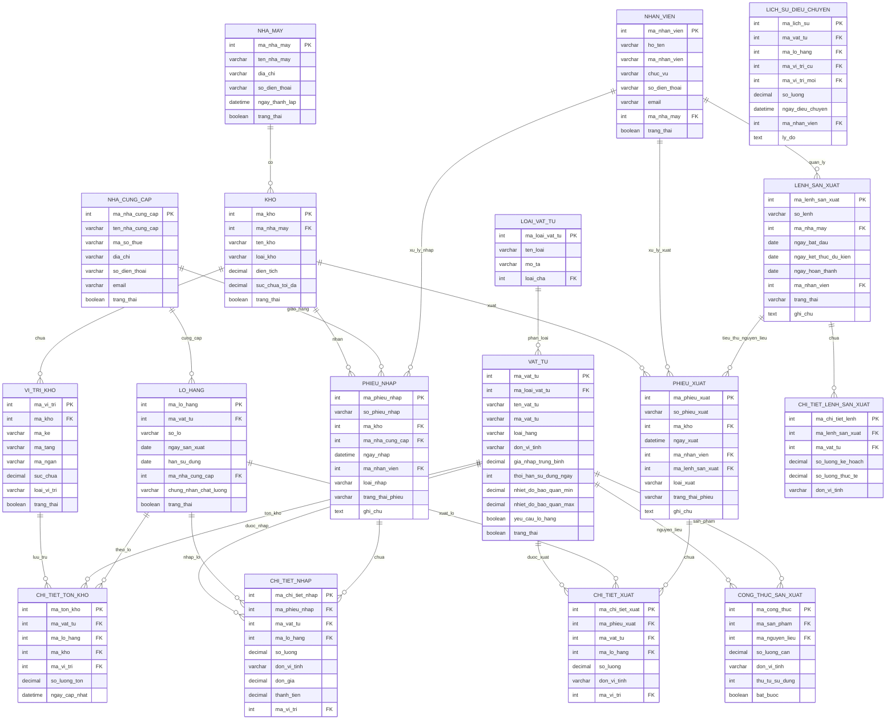

# Sơ đồ ERD - Hệ thống Quản lý Kho Thông minh

## Sơ đồ tổng quan

## Giải thích các mối quan hệ chính

### Quan hệ 1-N (One-to-Many)
- Một NHA_MAY có nhiều KHO
- Một KHO có nhiều VI_TRI_KHO
- Một VAT_TU có nhiều LO_HANG
- Một PHIEU_NHAP có nhiều CHI_TIET_NHAP
- Một PHIEU_XUAT có nhiều CHI_TIET_XUAT

### Quan hệ đặc biệt
- VAT_TU tự tham chiếu trong CONG_THUC_SAN_XUAT (một vật tư có thể là nguyên liệu hoặc sản phẩm)
- LOAI_VAT_TU tự tham chiếu (hỗ trợ phân cấp loại vật tư)

### Bảng trung gian
- CHI_TIET_TON_KHO: Kết nối VAT_TU, LO_HANG, KHO, VI_TRI_KHO
- CONG_THUC_SAN_XUAT: Kết nối VAT_TU với chính nó (nguyên liệu -> sản phẩm)
