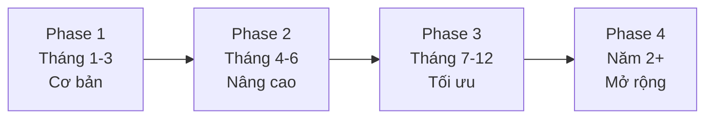
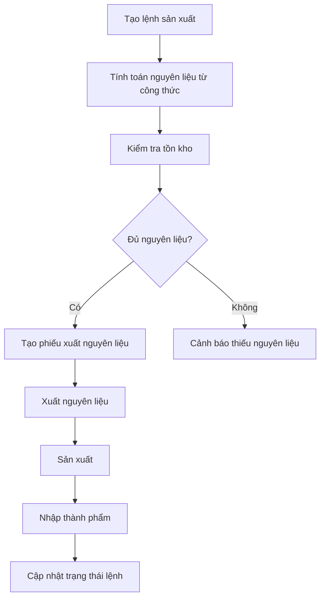
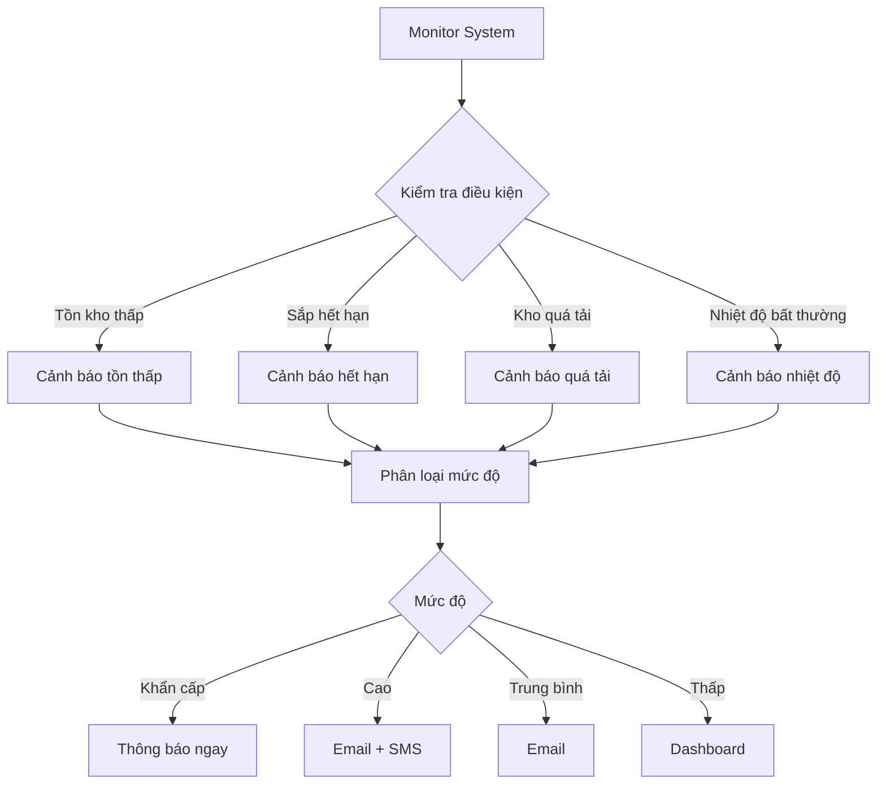
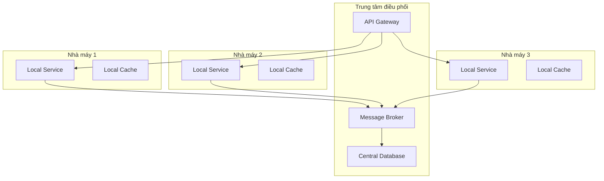

# Chiến lược Mở rộng Hệ thống

## Tổng quan Roadmap

---

## Phase 1: Hệ thống Cơ bản (Tháng 1-3)

### Mục tiêu

Xây dựng chức năng cốt lõi cho 1 nhà máy với 1-2 kho, tập trung vào quản lý nhập xuất và tồn kho cơ bản.

### Các bảng triển khai

| Nhóm          | Bảng               | Mục đích                                 |
| ------------- | ------------------ | ---------------------------------------- |
| Cơ sở hạ tầng | `NHA_MAY`          | Quản lý thông tin nhà máy                |
|               | `KHO`              | Quản lý các kho hàng                     |
|               | `VI_TRI_KHO`       | Quản lý vị trí chi tiết (kệ, tầng, ngăn) |
| Vật tư        | `LOAI_VAT_TU`      | Phân loại vật tư cấp 1                   |
|               | `VAT_TU`           | Thông tin chi tiết vật tư                |
|               | `LO_HANG`          | Quản lý lô hàng, truy xuất nguồn gốc     |
| Nhập xuất     | `PHIEU_NHAP`       | Phiếu nhập kho                           |
|               | `CHI_TIET_NHAP`    | Chi tiết vật tư trong phiếu nhập         |
|               | `PHIEU_XUAT`       | Phiếu xuất kho                           |
|               | `CHI_TIET_XUAT`    | Chi tiết vật tư trong phiếu xuất         |
|               | `CHI_TIET_TON_KHO` | Theo dõi tồn kho real-time               |
| Hỗ trợ        | `NHA_CUNG_CAP`     | Quản lý nhà cung cấp                     |
|               | `NHAN_VIEN`        | Quản lý nhân viên kho                    |

### Chức năng chính

Hệ thống hỗ trợ nhập kho từ nhà cung cấp với ghi nhận thông tin lô hàng, phân bổ vị trí lưu kho và cập nhật tồn kho real-time. Xuất kho áp dụng nguyên tắc FIFO với kiểm tra số lượng tồn trước khi xuất. Báo cáo cơ bản bao gồm nhập xuất tồn theo ngày, theo nhà cung cấp và lô hàng sắp hết hạn.

### Giới hạn kỹ thuật

| Tiêu chí           | Giới hạn |
| ------------------ | -------- |
| Số SKU             | 10,000   |
| Giao dịch/tháng    | 50,000   |
| Số nhà máy         | 1        |
| Số kho             | 2-3      |
| Tính năng sản xuất | Không    |

### Công nghệ đề xuất

Database sử dụng SQLite cho demo hoặc PostgreSQL cho production. Backend triển khai REST API đơn giản với Node.js/Express hoặc Python/Flask. Frontend sử dụng React hoặc Vue.js. Authentication dùng JWT token. Deployment trên single server không cần load balancer.

---

## Phase 2: Tích hợp Sản xuất (Tháng 4-6)

### Mục tiêu

Mở rộng hệ thống để quản lý quy trình sản xuất, tính toán nguyên liệu tự động và theo dõi hiệu suất sản xuất.

### Các bảng mới

| Nhóm     | Bảng                     | Mục đích                     |
| -------- | ------------------------ | ---------------------------- |
| Sản xuất | `LENH_SAN_XUAT`          | Quản lý lệnh sản xuất        |
|          | `CHI_TIET_LENH_SAN_XUAT` | Chi tiết sản phẩm trong lệnh |
|          | `CONG_THUC_SAN_XUAT`     | Công thức sản xuất (BOM)     |
| Theo dõi | `LICH_SU_DIEU_CHUYEN`    | Lịch sử điều chuyển vật tư   |

### Nâng cấp bảng hiện có

Bảng `LOAI_VAT_TU` được nâng cấp hỗ trợ phân cấp đa cấp thông qua trường `loai_cha` để tạo cấu trúc cây phân loại. Bảng `VAT_TU` phân biệt rõ ràng giữa nguyên liệu, bán thành phẩm và thành phẩm. Bảng `PHIEU_XUAT` được liên kết với `LENH_SAN_XUAT` thông qua trường `ma_lenh_san_xuat`.

### Quy trình sản xuất

### Chức năng mới

Hệ thống quản lý công thức sản xuất với định nghĩa nguyên liệu bắt buộc và tùy chọn, thứ tự sử dụng và tính toán định mức. Lệnh sản xuất tự động tính toán nguyên liệu cần thiết, kiểm tra tồn kho và theo dõi tiến độ kế hoạch so với thực tế. Xuất nguyên liệu áp dụng FEFO cho nguyên liệu có hạn sử dụng. Nhập thành phẩm tự động tạo lô hàng mới và tính hạn sử dụng. Báo cáo bao gồm hiệu suất sản xuất, tiêu hao nguyên liệu và truy xuất nguồn gốc.

### Giới hạn kỹ thuật

| Tiêu chí                | Giới hạn |
| ----------------------- | -------- |
| Số SKU                  | 50,000   |
| Giao dịch/tháng         | 200,000  |
| Số nhà máy              | 1        |
| Số kho                  | 5-10     |
| Công thức sản xuất      | 100-500  |
| Lệnh sản xuất đồng thời | 50-100   |

### Công nghệ đề xuất

Database sử dụng PostgreSQL với partitioning. Backend chuyển sang microservices architecture với service riêng cho quản lý kho, sản xuất và báo cáo. Message queue dùng RabbitMQ hoặc Apache Kafka cho xử lý bất đồng bộ. Caching dùng Redis cho dữ liệu thường xuyên truy cập. API hỗ trợ RESTful và GraphQL cho báo cáo phức tạp. Background jobs dùng Celery hoặc Bull cho tính toán nguyên liệu và cập nhật tồn kho.

---

## Phase 3: Tối ưu và Thông minh (Tháng 7-12)

### Mục tiêu

Nâng cao hiệu suất hệ thống, thêm tính năng thông minh với AI/ML, tự động hóa quy trình và cung cấp phân tích dữ liệu nâng cao.

### Các bảng mới

| Bảng             | Mục đích              | Dữ liệu chính                                   |
| ---------------- | --------------------- | ----------------------------------------------- |
| `DU_BAO_NHU_CAU` | Dự báo nhu cầu vật tư | Tháng dự báo, số lượng, độ tin cậy, phương pháp |
| `CANH_BAO`       | Cảnh báo tự động      | Loại cảnh báo, mức độ, trạng thái xử lý         |
| `TOI_UU_VI_TRI`  | Tối ưu vị trí lưu kho | Vị trí hiện tại, vị trí đề xuất, điểm tối ưu    |
| `PHAN_TICH_ABC`  | Phân tích ABC vật tư  | Nhóm ABC, giá trị xuất, tỷ lệ                   |
| `KPI_KHO`        | KPI và metrics kho    | Tỷ lệ sử dụng, số lần nhập xuất, giá trị tồn    |

### Hệ thống cảnh báo

### Dự báo nhu cầu

Hệ thống thu thập dữ liệu tiêu thụ 12-24 tháng, phát hiện xu hướng và tính mùa vụ. Mô hình dự báo sử dụng time series forecasting (ARIMA, Prophet) và machine learning (LSTM, Random Forest). Ensemble methods kết hợp nhiều mô hình và tự động chọn mô hình tốt nhất cho từng sản phẩm. Đầu ra bao gồm dự báo 1-3 tháng tới với độ tin cậy, đề xuất kế hoạch mua hàng và cảnh báo thay đổi lớn.

### Tối ưu vị trí

Phân tích ABC phân nhóm vật tư theo giá trị: Nhóm A (20% SKU, 80% giá trị) đặt gần cửa dễ lấy, Nhóm B (30% SKU, 15% giá trị) vị trí trung bình, Nhóm C (50% SKU, 5% giá trị) vị trí xa. Tối ưu slotting phân tích tần suất xuất kho, tính khoảng cách di chuyển và đề xuất vị trí tối ưu. Tối ưu lộ trình picking sử dụng thuật toán tìm đường đi ngắn nhất và gom nhóm đơn hàng.

### Database Optimization

| Kỹ thuật           | Mục đích               | Ví dụ                                                         |
| ------------------ | ---------------------- | ------------------------------------------------------------- |
| Partitioning       | Chia nhỏ bảng lớn      | Partition `PHIEU_NHAP` theo quý                               |
| Materialized Views | Cache kết quả phức tạp | View tổng hợp tồn kho                                         |
| Composite Index    | Tối ưu query phức tạp  | Index (`ma_kho`, `ma_vat_tu`, `so_luong_ton`)                 |
| Partial Index      | Index dữ liệu active   | Index `PHIEU_NHAP` WHERE `trang_thai` IN ('NHAP', 'DA_DUYET') |

### Caching Strategy

Redis cache danh sách vật tư (TTL 1 giờ), công thức sản xuất (TTL 24 giờ), tồn kho tổng hợp (TTL 5 phút) và thông tin kho (TTL 1 giờ). Cache invalidation khi có thay đổi dữ liệu, sử dụng Redis Pub/Sub cho distributed cache và lazy loading cho dữ liệu ít thay đổi.

### Giới hạn kỹ thuật

| Tiêu chí             | Giới hạn  |
| -------------------- | --------- |
| Số SKU               | 200,000   |
| Giao dịch/tháng      | 1,000,000 |
| Số nhà máy           | 1         |
| Số kho               | 20+       |
| Công thức sản xuất   | 1,000+    |
| Người dùng đồng thời | 500+      |
| Response time (95%)  | < 200ms   |

### Công nghệ đề xuất

Infrastructure sử dụng PostgreSQL 14+ với Citus extension cho sharding, Redis Cluster (3 master, 3 replica), Elasticsearch 8+ cho full-text search, Apache Kafka cho event streaming và Apache Spark cho big data processing. Backend triển khai API Gateway (Kong), microservices với Docker, WebSocket cho real-time và Celery cho background jobs. Frontend dùng React 18+ với TypeScript, Redux Toolkit, D3.js cho charts và Socket.io client. AI/ML dùng Python với scikit-learn, TensorFlow, Prophet và MLflow. Monitoring dùng Prometheus + Grafana, ELK Stack và Jaeger.

---

## Phase 4: Đa nhà máy và Mở rộng (Năm 2+)

### Mục tiêu

Hỗ trợ nhiều nhà máy, tích hợp chuỗi cung ứng và mở rộng ra quy mô enterprise.

### Các bảng mới

| Bảng                           | Mục đích                       |
| ------------------------------ | ------------------------------ |
| `DIEU_CHUYEN_NHA_MAY`          | Điều chuyển hàng giữa nhà máy  |
| `CHI_TIET_DIEU_CHUYEN_NHA_MAY` | Chi tiết vật tư điều chuyển    |
| `KE_HOACH_TONG_THE`            | Kế hoạch sản xuất tổng thể     |
| `CHI_TIET_KE_HOACH`            | Chi tiết kế hoạch theo nhà máy |
| `TICH_HOP_BEN_NGOAI`           | Cấu hình tích hợp ERP/WMS/TMS  |
| `LOG_DONG_BO`                  | Log đồng bộ dữ liệu            |

### Kiến trúc đa nhà máy

### Chức năng mới

Quản lý đa nhà máy với điều chuyển hàng giữa các nhà máy, theo dõi trạng thái vận chuyển và tối ưu phân bổ nguồn lực. Kế hoạch sản xuất tổng thể phân bổ đơn hàng cho các nhà máy dựa trên công suất và chi phí. Tích hợp ERP (SAP, Oracle) cho tài chính và kế toán, WMS cho quản lý kho nâng cao và TMS cho vận tải. API cho đối tác và mobile app cho nhân viên kho.

### Database Sharding

Sharding theo nhà máy với mỗi nhà máy là một shard riêng, giảm tải và tăng hiệu suất. Sharding theo thời gian cho time-series data như giao dịch và lịch sử. Global tables cho dữ liệu chung như danh mục vật tư và công thức sản xuất.

### Multi-tenancy

Mỗi nhà máy là một tenant với shared database sử dụng `tenant_id` hoặc database riêng cho nhà máy lớn. Tenant isolation đảm bảo dữ liệu không bị trộn lẫn. Resource allocation phân bổ tài nguyên theo nhu cầu từng tenant.

### Giới hạn kỹ thuật

| Tiêu chí             | Giới hạn                      |
| -------------------- | ----------------------------- |
| Số SKU               | Không giới hạn                |
| Giao dịch/tháng      | Không giới hạn                |
| Số nhà máy           | Nhiều nhà máy, nhiều quốc gia |
| Công thức sản xuất   | Hàng nghìn                    |
| Người dùng đồng thời | Hàng nghìn                    |

### Công nghệ đề xuất

Database sử dụng PostgreSQL + Citus hoặc CockroachDB cho distributed SQL. Message queue dùng Apache Kafka cho event streaming. API Gateway dùng Kong hoặc AWS API Gateway. Container orchestration dùng Kubernetes. Cloud deployment trên AWS, Azure hoặc GCP. Monitoring dùng Prometheus + Grafana. Logging dùng ELK Stack.

---

## Chiến lược Xử lý Tăng trưởng Dữ liệu

### Archiving Strategy

| Loại dữ liệu | Thời gian  | Lưu trữ        | Truy cập   | Backup     |
| ------------ | ---------- | -------------- | ---------- | ---------- |
| Hot          | 0-6 tháng  | Database chính | Nhanh      | Hàng ngày  |
| Warm         | 6-24 tháng | Bảng archive   | Trung bình | Hàng tuần  |
| Cold         | >24 tháng  | Data warehouse | Chậm       | Hàng tháng |

### Partitioning Strategy

Range partitioning theo thời gian cho bảng `PHIEU_NHAP`, `PHIEU_XUAT` theo quý hoặc tháng. Hash partitioning theo `ma_kho` cho bảng `CHI_TIET_TON_KHO` để phân tán dữ liệu đều. List partitioning theo `loai_hang` cho bảng `VAT_TU` nếu cần tách riêng từng loại.

### Backup và Recovery

| Loại backup     | Tần suất  | Retention | RTO               | RPO              |
| --------------- | --------- | --------- | ----------------- | ---------------- |
| Full backup     | Hàng tuần | 30 ngày   | 4 giờ (Phase 1)   | 1 ngày (Phase 1) |
| Incremental     | Hàng ngày | 30 ngày   | 2 giờ (Phase 2)   | 4 giờ (Phase 2)  |
| Transaction log | 15 phút   | 7 ngày    | 1 giờ (Phase 3)   | 1 giờ (Phase 3)  |
| Continuous      | Real-time | 7 ngày    | 15 phút (Phase 4) | 5 phút (Phase 4) |

### Cost Estimation

| Phase   | Database      | Infrastructure | Services | Total/tháng |
| ------- | ------------- | -------------- | -------- | ----------- |
| Phase 1 | $50-100       | $100-200       | -        | ~$200       |
| Phase 2 | $200-500      | $500-1,000     | $100     | ~$1,000     |
| Phase 3 | $1,000-2,000  | $2,000-5,000   | $1,000   | ~$5,000     |
| Phase 4 | $5,000-10,000 | $10,000-20,000 | $2,000   | ~$20,000    |
